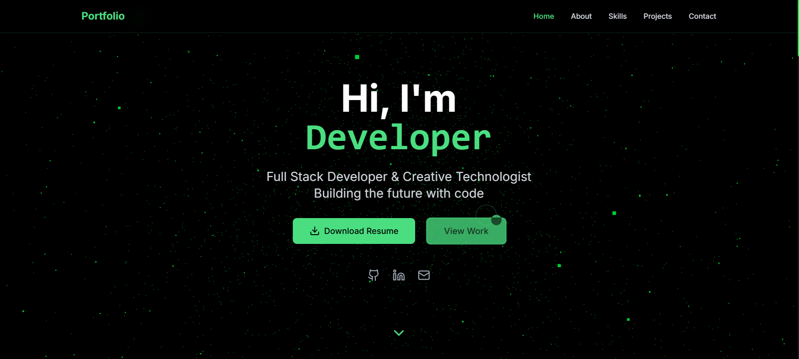

# Portfolio-Tailwand-CSS
Bu loyiha portfolio uchun ishlab chiqilgan

# 🚀 Developer Portfolio Website

Immersive, modern and animated **3D Developer Portfolio** built with performance and interactivity in mind.

## 📸 Preview





> 🔍 Yuqoridagi rasm loyihaning bosh sahifasidan olingan skrinshotdir. Agar boshqa joyga qo‘ygan bo‘lsangiz, rasm manzilini `./public/screenshot.png` o‘rniga yangilang.

---

## 🛠 Ishlatilgan Texnologiyalar

## 🚀 Technologies Used


## ⚙️ Loyihani ishga tushurish

1. Repository’ni klonlang:
   ```bash
   git clone https://github.com/username/portfolio.git
   cd portfolio/project
